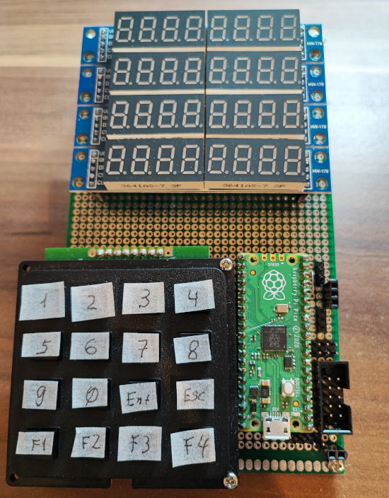
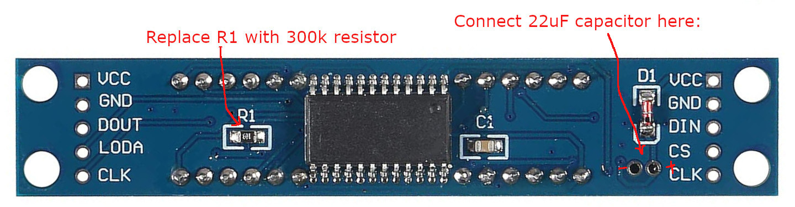

# Raspberry PI pico universal measuring tool

**Features:**
1. 3-channel 0-19v voltmeter with calibration support. Resolution is 0.01v.
2. 2-channel 1Hz-30MHz frequency counter. Calibration is supported.
3. 2-channel 10Hz-9999kHz PWM generator
4. Capacitance meter. Range is 1pF-10uF. Maximal resolution is 0.1 pF. Calibration is supported.
5. Inductance meter. Uses [this adapter](https://github.com/sergz72/Projects/tree/master/lmeter). Range is 0.1uH-10H. Maximal resolution is 0.01uH.
6. External I2C device support:
  - SI5351 DDS generator, Frequency range: 7813Hz...100MHz
  - INA226 current shunt and power monitor. Voltage range is 0..36v, resolution is 1mV, Current range with 0.1Ohm shunt resistor is -0.8..0.8A, resolution: 0.1mA
  - MCP3421 ADC with voltage divider 1:11 (1MOhm resistor from input to ADC, 100kOhm resistor+0.1uf capacitor from ADC to GND). Range is -4..+33v. Resolution is 0.01mV. Calibration is supported.

**Uses:**
- 4x[MAX7219 LED board](https://www.amazon.de/gp/product/B07Z7RLGC2)
- [4x4 Matrix Keypad](https://www.amazon.de/gp/product/B07ZSYP188)

**Required MAX7219 board modifications for power line noise reduction:**

**Pins:**

**I2C:**
- SDA: GP0
- SCL: GP1

**MAX7219:**
- CLK: GP16
- CS: GP17
- First module DIN: GP18
- Second module DIN: GP19
- Third module DIN: GP20
- Fourth module DIN: GP21

**Keypad:**
- OUT pins: GP18, GP19, GP20, GP21
- IN pins: GP22, GP2, GP3, GP4

**Capacitance meter:**
- CX input: between GP11 and GND
- Resistor 220 Ohm between GP12 and GP11
- Resistor 100 kOhm between GP14 and GP11

**Frequency meter:**
- Channel 1 input pin: GP10
- Channel 2 input pin: GP9

**PWM Generator:**
- Channel 1 output pin: GP15
- Channel 2 output pin: GP13

**Voltage meter:**
- Channel 1: pin GP26. Voltage divider: 1MOhm resistor from input to GP26, 200kOhm resistor+0.1uF capacitor from GP26 to GND
- Channel 2: pin GP27. Voltage divider: 1MOhm resistor from input to GP27, 200kOhm resistor+0.1uF capacitor from GP27 to GND
- Channel 3: pin GP28. Voltage divider: 1MOhm resistor from input to GP28, 200kOhm resistor+0.1uF capacitor from GP28 to GND
