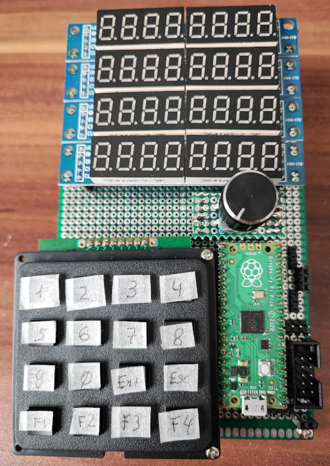

# Raspberry PI pico universal measuring tool

**Features:**
1. 3-channel voltmeter
2. 2-channel frequency counter
3. 2-channel PWM generator
4. Capacitance meter
5. External I2C device support:
  - SI5351 DDS generator
  - INA226 current shunt and power monitor
  - MCP3421 ADC

**Uses:**
- 4x[MAX7216 LED board](https://www.amazon.de/gp/product/B07Z7RLGC2)
- [4x4 Matrix Keypad](https://www.amazon.de/gp/product/B07ZSYP188)

**Pins:**

**I2C:**
- SDA: GP0
- SCL: GP1

**MAX7219:**
- CLK: GP16
- CS: GP17
- First module DIN: GP18
- Second module DIN: GP19
- Third module DIN: GP20
- Fourth module DIN: GP21

**Keypad:**
- OUT pins: GP18, GP19, GP20, GP21
- IN pins: GP22, GP2, GP3, GP4

**Capacitance meter:**
- CX input: between GP11 and GND
- Resistor 220 Ohm between GP12 and GP11
- Resistor 100 kOhm between GP14 and GP11

**Frequency meter:**
- Channel 1 input pin: GP10
- Channel 2 input pin: GP9

**PWM Generator:**
- Channel 1 output pin: GP15
- Channel 2 output pin: GP13

**Voltage meter:**
- Channel 1: pin GP26
- Channel 2: pin GP27
- Channel 3: pin GP28
