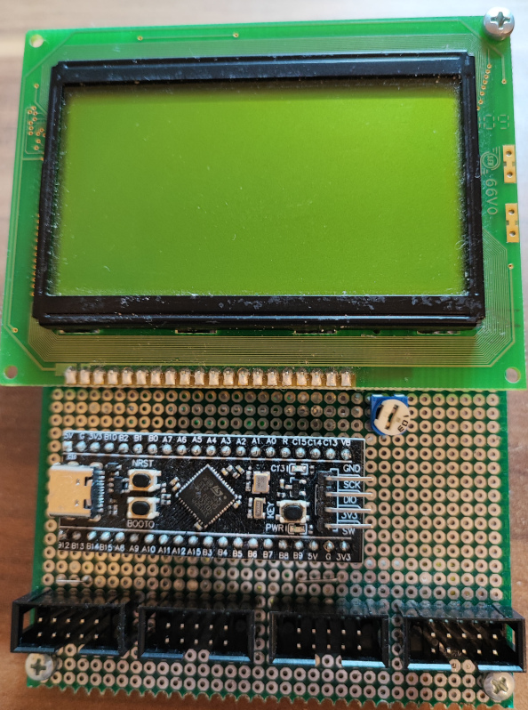

# STM32401 Blue pill universal measuring tool

**Uses:**
- [STM32F401 Development Board](https://www.amazon.de/gp/product/B0B5DVM7KH)
- 128x64 lcd module with ks0108 controller
- Optionally [TM1638 LED/keyboard](https://www.amazon.de/gp/product/B07Y9QB74M)

**Pins:**

**128x64 LCD:**
- VDD: 5v
- DI: PC14
- RW: GND
- E: PC15
- D0: PA0
- D1: PA1
- D2: PA2
- D3: PA3
- D4: PA4
- D5: PA5
- D6: PA6
- D7: PA7
- CS1: PB0
- CS2: PB1
- RES: PB2

**I2C:**

Channel1:
- SDA: PB10
- SCL: PB3

Channel2:
- SDA: PA8
- SCL: PB4

Channel3:
- SDA: PB6
- SCL: PB7

Channel4:
- SDA: PB8
- SCL: PB9

**Optional TM1638 module connection(Uses I2C channel 4 pins):**
- PB9: GND
- PB8: DIO
- PA15: CLK
- CS: PB5
