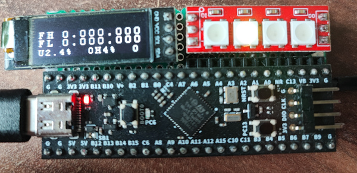

# Advanced logic probe

## Features
- Four WS2812 LEDs for logical one/zero/floating/pulse values.
- LCD for Frequency/duty/voltage measurements.
- PWM output on PB9
- DAC output on PA5
- USB CDC for DAC/PWM settings.
- Duty cycle measurement.
- Frequency measurement for high /low level comparator outputs.
- Input voltage measurement.
- Default voltage on the input pin:
  - in logic probe mode: 0.8 v
  - in voltmeter mode: 0v
- Input resistance is about 75KOhm
- High/low voltage thresholds are adjustable:
  - high level threshold: 2500, 2000, 15000, 1000, 880 mv
  - low level threshold: 10, 200, 300, 400, 800 mv
